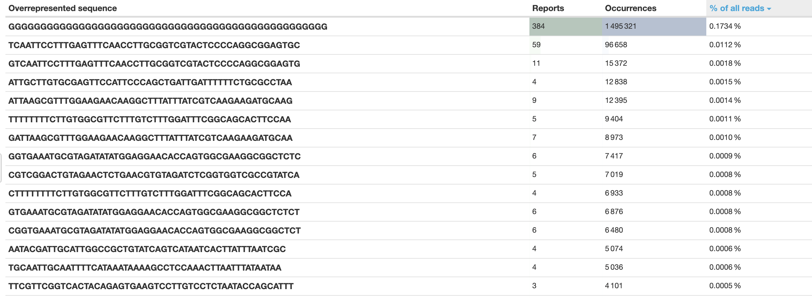

# ARC-workflow

Described below is the workflow we performed to determine AMR genes from Enterococcus spp. isolates

## Genomic Libary prep
<Finish Later>

## Next Gen Illumina Sequencing

DNA sequencing was done through next gen Illumina sequencing. In summary:
1. DNA was fragmented and adapters were added
2. DNA anchored via capture sequences on adapters (added to both sides), with one side binding to flow cell anchor
3. Bridge amplifcation makes a cluster of thousands of copies of the same DNA fragment
5. Flourescently tagged bases are added one by one, average flourescent signal is detected for each cluster.

Dual Index

## Initial quality check
Although it is important to trim the reads to get a more accurate representation of the final genome (removing low quality reads, removing adapters), it is also a good practise to check the quality of the reads prior to trimming, to have a baseline to compare the trims to.

### percent adapter content

Note the number the percentage of sequences being at yellow/red zones for adapter content, indicating that adapters have not been trimmed  off yet (which is to be expected)

### Over represented seequences:

This shows the most overrepresented sequences, typically being adapter sequences, or possible contamination from the sequencing / extraction process 

[Open the full table here(Markdown)](fastqc_top_overrepresented_sequences_table_pretrim.md)

     

## eautils mcf + cutadapt:

It is standard practise to 
