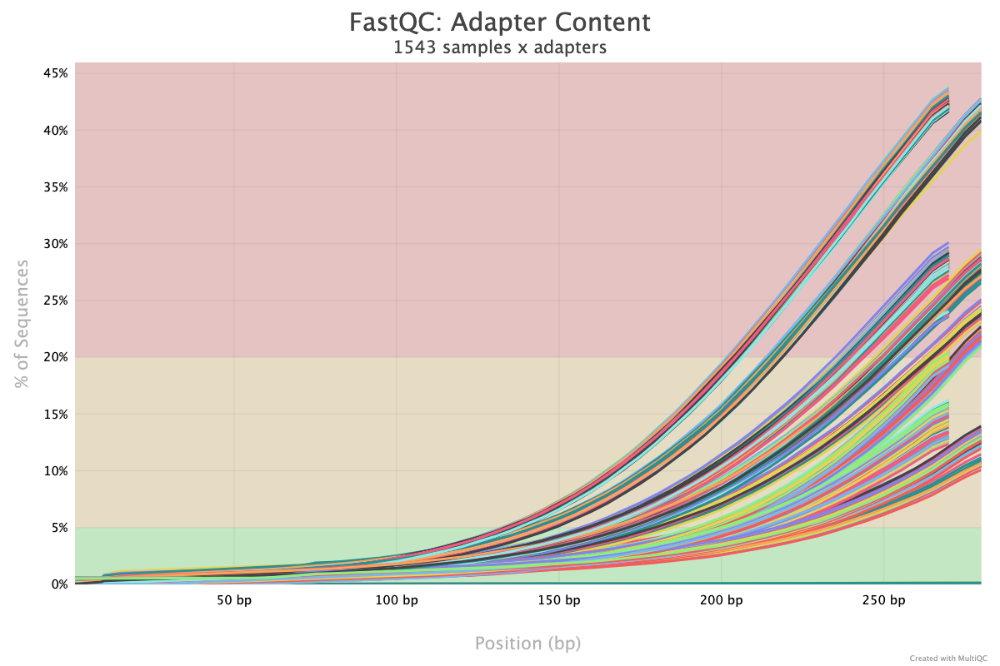
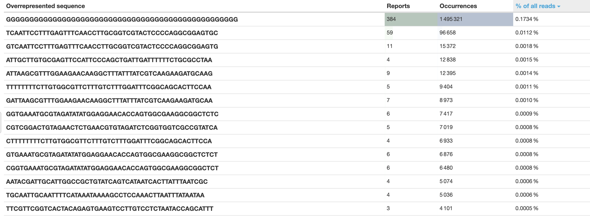
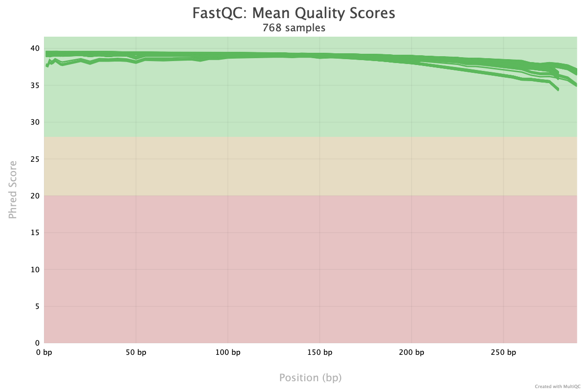

# ARC-workflow

Described below is the workflow we performed to determine AMR genes from Enterococcus spp. isolates

## Genomic Libary prep
<Finish Later>

## Next Gen Illumina Sequencing

DNA sequencing was done through next gen Illumina sequencing. In summary:
1. DNA was fragmented and adapters were added
2. DNA anchored via capture sequences on adapters (added to both sides), with one side binding to flow cell anchor
3. Bridge amplifcation makes a cluster of thousands of copies of the same DNA fragment
5. Flourescently tagged bases are added one by one, average flourescent signal is detected for each cluster.

Dual Index

## Initial quality check
Although it is important to trim the reads to get a more accurate representation of the final genome (removing low quality reads, removing adapters), it is also a good practise to check the quality of the reads prior to trimming, to have a baseline to compare the trims to.

### percent adapter content

Note the number the percentage of sequences being at yellow/red zones for adapter content, indicating that adapters have not been trimmed  off yet (which is to be expected)

### Over represented sequences:

This shows the sequences that are represented in the reads more often than should be normal in typical library.
It is possible that these sequences are caused by leftover DNA fragments from the sequencing step, highlighting the importance of a rigorous trimming procedure.
Note the poly-G repeated sequence, which is repeated much more often than the other repeats. We presently have no clear explenation for this phenomenon, and we will attempt to remove some of these reads by considering the poly-G tail as a 

[Open the full table here(Markdown)](fastqc_top_overrepresented_sequences_table_pretrim.md)

## Overall quality

The pretrim quality score is very good, indicating that the detected bases are highly likely to be the real bases within the genomes that were sequenced. Note the dropoff in quality at larger sequence lenghts, this is caused by DNA primer losing effectiveness at longer lenghts, and can be alleviated by eliminating lower quality reads through trimming.
     

## eautils mcf + cutadapt:

It is standard practise to use trimming software to remove any vestiages from the  sequencing procedure, such adapter sequences that are used as part of the sequencing procuedure. The software also removes lower quality (phred) reads, giving higher overall quality reads, and therefore more accurate data.

We initially used cutadapt but found that some adapter sequences were still being detected by fastqc, we switched to eautils tool as part of the the mcf suite, and inputted a custum adapter list that was commonly used within the vetmed department. Critically, we manually inputted a new "adapter" that consisted of the poly-G sequence that was detected by multiqc. While a bit more manual than we preffered, we concluded that the poly-G tail is likely some sort of artifact that is not indicative of the actual genome, so removing as much of it as possible was critical to obtain the most accurate reads possible

### second quality check
after the triming program was run, we ran a second fastqc / multiqc quality check to visualize the improvements:

#### intial trim with cutadapt: no adapters given

